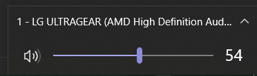
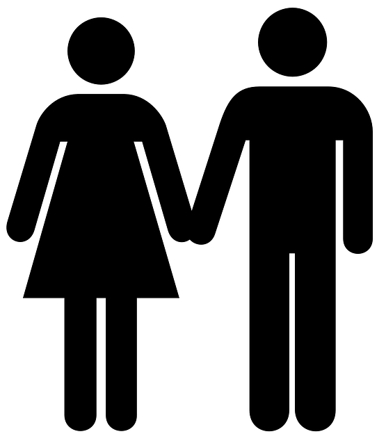
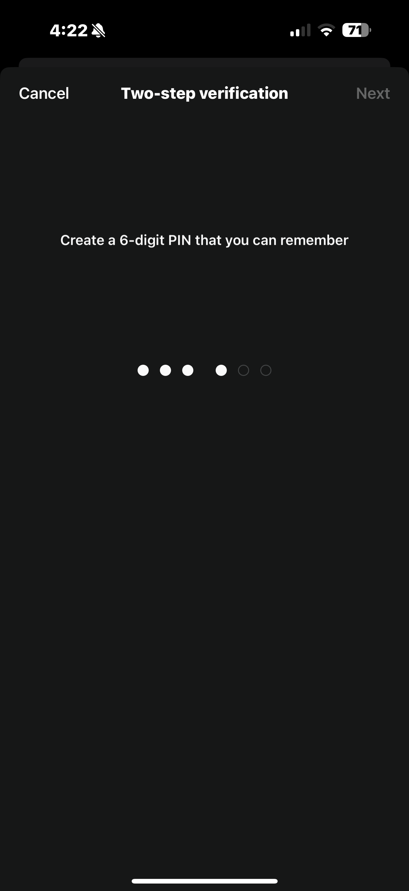

# Constraints

## Aufgabenstellung

Erklären Sie, warum Constraints zur Fehlervermeidung beitragen.

Geben Sie dann jeweils ein gutes Beispiele aus einem UI für

- Physikalische Constraints
- Kulturelle Constraints
- Logische Constraints

Hinweise:

"Beispiel geben" bedeutet hier, dass Sie die Beispiele nicht nur benennen, sondern auch argumentieren, warum sie ein Beispiel für das jeweilige Constraints sind. Fügen Sie auch Bilder des UI ein (sofern möglich).
"aus einem UI" bedeutet nicht, dass alle Beispiele aus dem selben UI sein müssen.
Falls Sie kein Beispiel aus einem UI finden können, überlegen Sie sich bitte, wo ein entsprechendes Constraint auch außerhalb einer UI vorhanden ist.

## Lösung

### Physikalische Constraints

In der digitalen aber auch in der realen Welt sind Schieberegler oft eingeschränkt. Lautstärke kann meist nur zwischen 0% und 100% bzw. einer bestimmten Spanne an Dezibel eingestellt werden, da andere Werte entweder das Gehör schädigen oder für die Nutzung keine Sinn ergeben würden.

### Kulturelle Constraints

Symbole auf Toilettentüren werden oft als Silhouetten dargestellt, sodass keine Sprachlichen Barrieren entstehen auf der Suche nach der richtigen Toilette. Die Bezeichnungen Mann und Frau würden die meisten Besucher eines anderen Landes nicht verstehen.

### Logische Constraints

In Formularen werden oft die Login/Weiter Buttons ausgegraut, bis der User alle benötigten Felder ausgefüllt hat. Somit werden keine Falschen Requests an den Server gesendet und der User merkt, dass noch etwas fehlt. Es werden auch oft Buttons disabled wenn ein gewähltes Passwort nicht den Sicherheitsrichtlinien entspricht. Im Screenshot sieht man beide Fälle aufeinmal.

## About

Made with ♥ by Aaron Levi Can