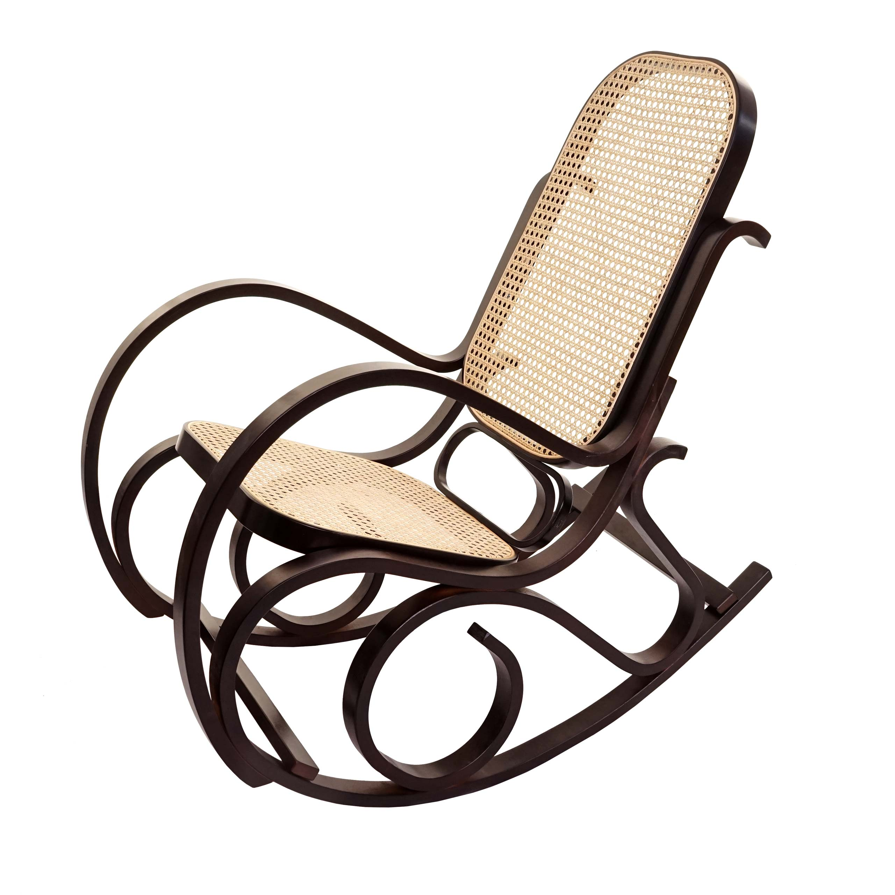

# Affordances

## Aufgabenstellung

Diskutieren Sie die Affordances für die folgenden sechs Beispiele. Finden Sie zuerst Abbildungen der Gegenstände und machen Sie dann die Unterschiede innerhalb jeder Dreiergruppe deutlich.

- Dreiergruppe 1:
  - Schaukelstuhl
  - Fernsehsessel
  - Hocker
- Dreiergruppe 2:
  - Gummihammer
  - Zimmermannshammer
  - Richterhammer

## Lösung

### Dreiergruppe 1

Alle Gegenstände in der Gruppe haben etwas mit sitzen zutun. Nur kann jede Art von Stuhl anders benutzt werden und passt in andere Umgebungen. Der Schaukelstuhl wird benutzt um sich gemütlich hinzusetzen und währendessen zu schaukeln. Dieser steht oft in Wohn- und Schlafzimmern, kann aber auch auf Terassen bzw. Balkonen stehen dank seines Materials. Der Fernsehsessel dagegen steht meist in Wohnzimmern und seltener in anderen Räumen. Er wird selten bewegt, da er sehr schwer ist. Fernsehsessel sind oft teuer und werden selten ersetzt, bei einem Kauf macht man sich also viele Gedanken. Der Hocker hingegen kann leicht bewegt werden und wird seltener zum langen sitzen benutzt. Er kann für kurze arbeiten auf niedriger Höhe oder sehr hoher Höhe genutzt werden, wenn man sich auf ihn stellt. Keiner dieser Stühle passt in ein professionelles Umfeld, wie z.B einen Meetingraum.

### Dreiergruppe 2

Der Gummihammer wird benutzt um Dinge festzuhämmern ohne Gefahr zu laufen diese zu beschädigen. Er eignet sich z.B. für KFZ Mechaniker welche einen Bolzen festigen wollen. Der Zimmermannshammer hingegen hat einen festeren Kopf, da er oft für Nägel benutzt wird, welche sehr fest geschlagen werden müssen. Außerdem hat er weiter Funktionen wie z.B das aushebeln von Nägeln. Der Richterhammer hat die Aufgabe den Richter auditiv zu unterstützen indem er auf ein Stück Holz geschlagen wird. Er ist in keinsterweise geeignet für handwerkliche Arbeiten.

## About

Made with ❤️ by Aaron Levi Can